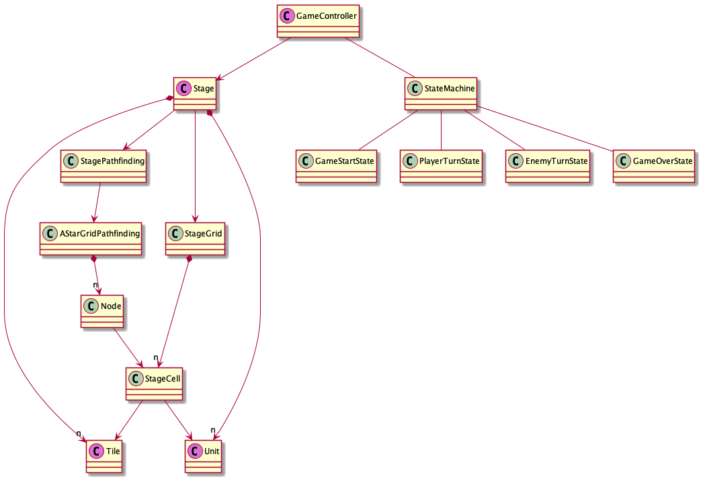

# cm12-turn-based-game

## 概要

Unity によるシンプルなターン制ゲームの基本部分試作

体当たりで敵を倒すだけで明確なゴールは無し。  
あくまで構造の試作として。

## Play

[WebGL](https://tukanpo.github.io/cm12-turn-based-game/)

#### 操作方法
- WASD = 移動 or 攻撃
- Space = ターンスキップ
- Enter = リスタート

## 環境

- Unity 2020.2.3f1
- 外部 Asset は特に無し

## 構造

雑に作っていって困ったら都度作り変える作戦  

書き方間違ってるかもしれないけどクラス図概略  
（紫色のクラスが Component）

### カメラ
`Cinemachine` の `Framing Transposer` を設定

### 敵の経路探索
単純な A* アルゴリズムで実装  
距離とか障害物の裏とか関係なく最短距離でプレイヤーを追いかけてくるだけ。  

`Node` からステージ内の状態を参照する為、 `StageCell` に `INodeContent` インターフェースを実装して `Node` に紐付けた。

### WebGL カスタムテンプレート
カスタムテンプレートを置いたけど [CSS わからなくて](https://d1q9av5b648rmv.cloudfront.net/v3/765x765/t-shirt/s/white/front/4256259/1594786231-736x377.jpg.3.4228+0.0+0.0.jpg?h=f5868cb89bb465603ee8889dadbddaa1d6bf7b8d&printed=true)いじるの諦めた  
（中身はデフォルトのまま）
