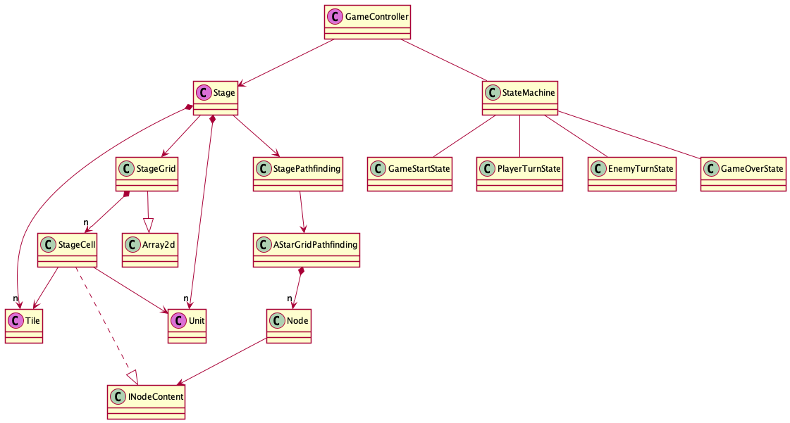

# cm12-turn-based-game

## 概要

Unity によるシンプルなターン制ゲームの基本部分試作

体当たりで敵を倒すだけで明確なゴールは無し。  
あくまで構造の試作として。

## Play

[WebGL](https://tukanpo.github.io/cm12-turn-based-game/)

#### 操作方法
- WASD = 移動 or 攻撃
- Space = ターンスキップ
- Enter = リスタート

## 環境

- Unity 2020.2.3f1

## メモ

クラス図概略  
書き方間違ってるかもしれない
（紫色のクラスは Component）

[class-overview.pu](PlantUML/class-overview.pu)

Stage と Unit 周りをきれいにしたい。
